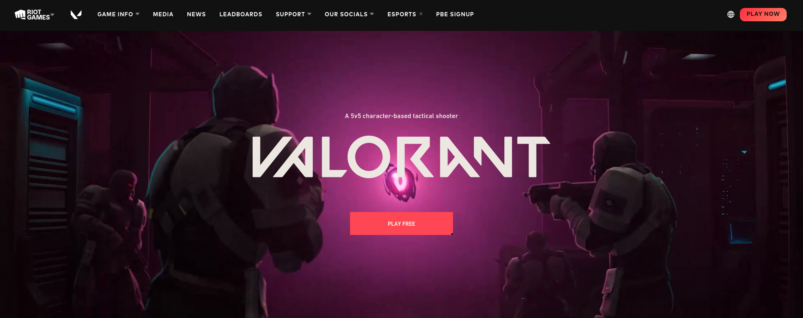
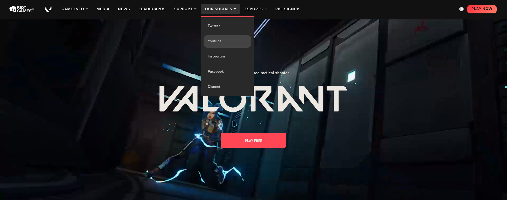

<!-- ABOUT THE PROJECT -->
# <b>VALORANT - Cloned Web Page</b>





<p>This is a clone web site of Valorant. The clone web site was designed for the purpose of learning of floating, z-index, CSS Pseudo elements and media elements. The cloned web page does not include all the features which the original web page has. Images and web site layout credits go to the original designers.</p>


## Built with using

* HTML 5 
* CSS 3 
 


## How to use this repository

* Open the terminal
* Then clone the repo using 
```
git clone https://github.com/nipunsperera/clone-of-valorant-web.git
```


<!-- CONTACT -->
## Contact

Nipun Perera - [@LinkedIn](https://www.linkedin.com/in/nipunperera96/)

Project Link: [https://github.com/nipunsperera/clone-of-valorant-web](https://github.com/nipunsperera/clone-of-valorant-web)


<!-- MARKDOWN LINKS & IMAGES -->
<!-- https://www.markdownguide.org/basic-syntax/#reference-style-links -->